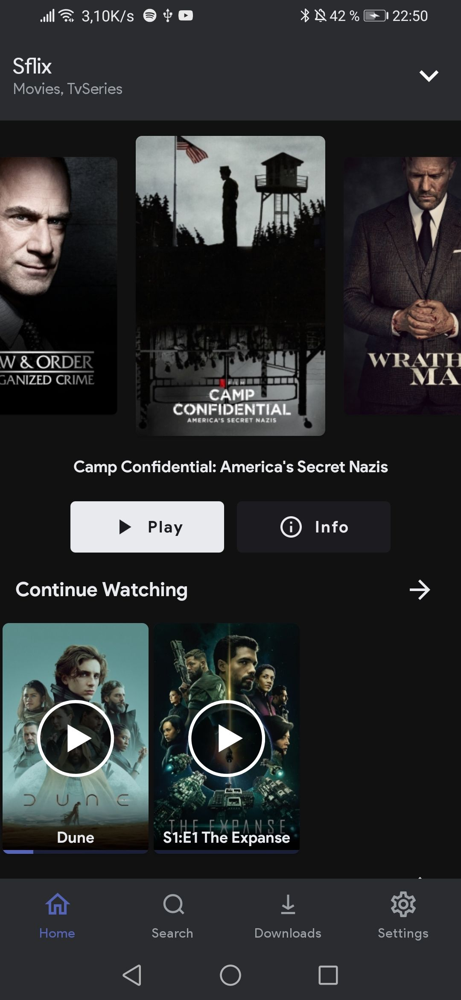
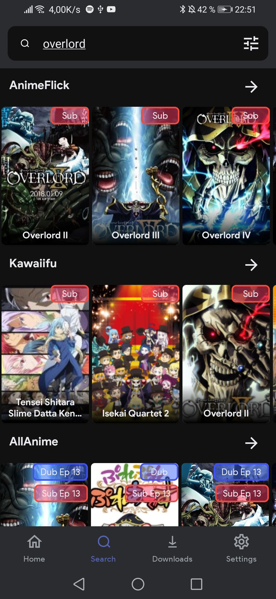
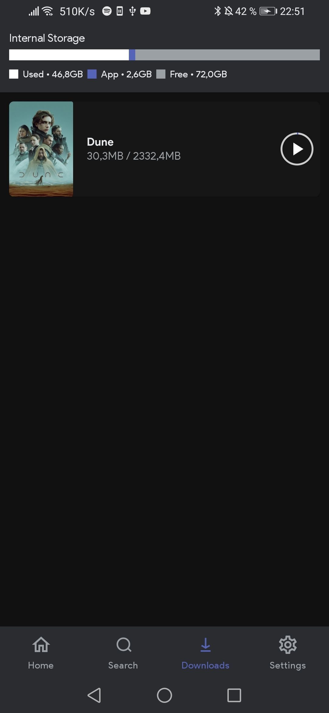
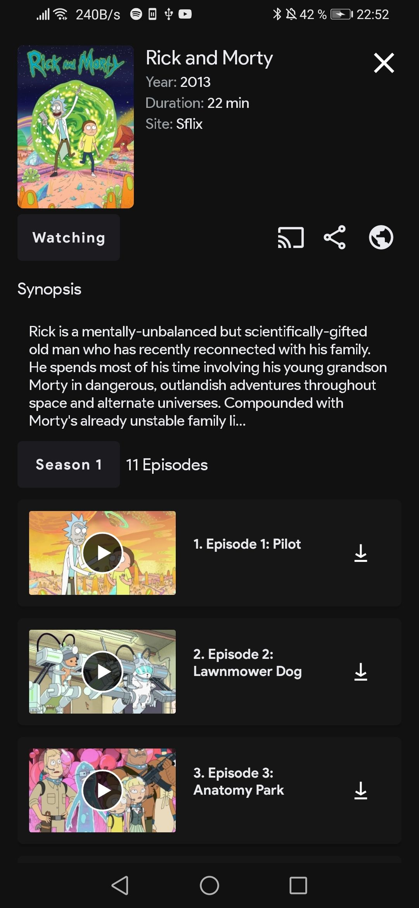
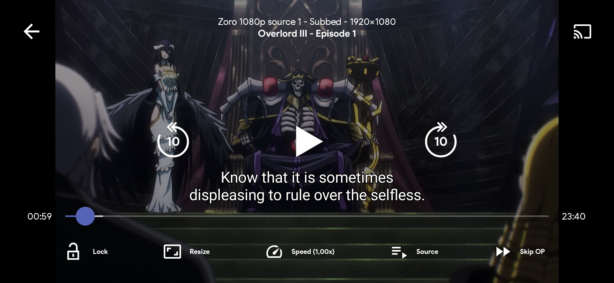

# CloudStream-3

<!--  -->

**DOWNLOAD:**
https://github.com/LagradOst/CloudStream-3/releases

***Features:***
+ **AdFree**, No ads whatsoever
+ No tracking/analytics
+ Bookmarks
+ Download and stream movies, tv-shows and anime
+ Chromecast

***Screenshots:***

***The list of supported languages:***
* 🇱🇧 Arabic
* 🇳🇱 Dutch
* 🇬🇧 English
* 🇫🇷 French
* 🇩🇪 German
* 🇬🇷 Greek
* 🇮🇳 Hindi
* 🇮🇹 Italian
* 🇲🇰 Macedonian
* 🇮🇳 Malayalam
* 🇳🇴 Norsk
* 🇵🇱 Polish
* 🇧🇷 Portuguese (Brazil)
* 🇷🇴 Romanian
* 🇪🇸 Spanish
* 🇸🇪 Swedish
* 🇵🇭 Tagalog
* 🇹🇷 Turkish
* 🇻🇳 Vietnamese

***Disclaimer:***

Any legal issues regarding the content on this application should be taken up with the actual file hosts and providers themselves as we are not affiliated with them.

In case of copyright infringement, please directly contact the responsible parties or the streaming websites.

The app is purely for educational and personal use.

CloudStream 3 does not host any content on the app, and has no control over what media is put up or taken down. CloudStream 3 functions like any other search engine, such as Google. CloudStream 3 does not host, upload or manage any videos, films or content. It simply crawls, aggregates and displayes links in a convenient, user-friendly interface.

It merely scrapes 3rd-party websites that are publicly accessable via any regular web browser. It is the responsibility of user to avoid any actions that might violate the laws governing his/her locality. Use CloudStream 3 at your own risk.

***Sites used:***

Look [here](https://lagradost.github.io/CloudStream-3/) for a comprehensive list
